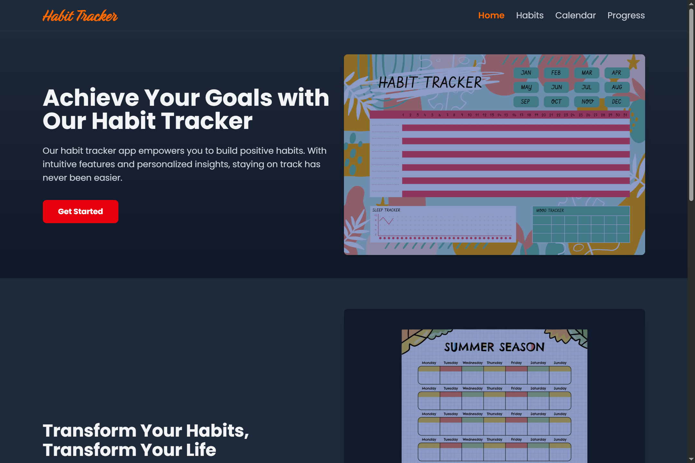
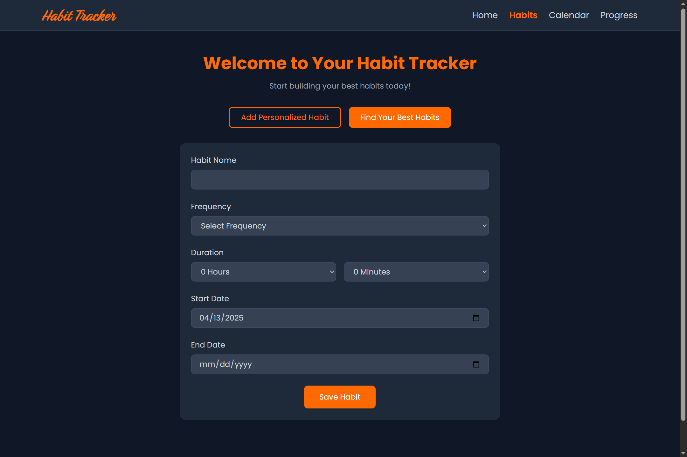
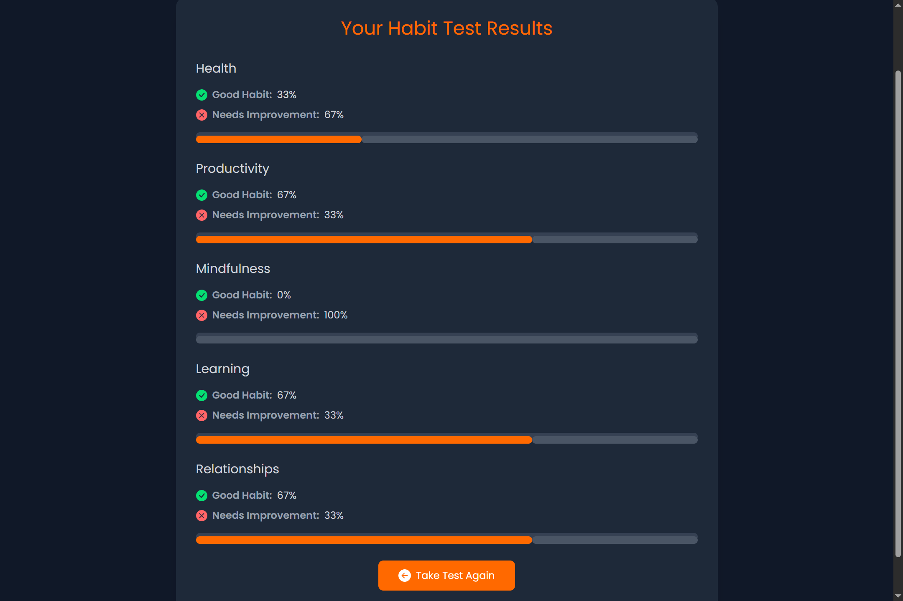
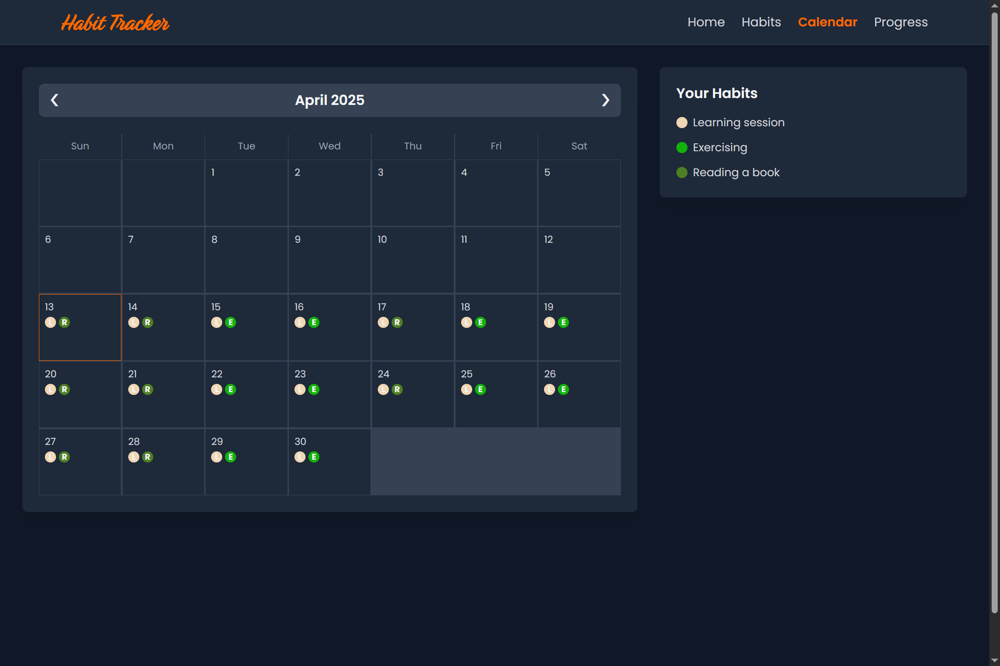
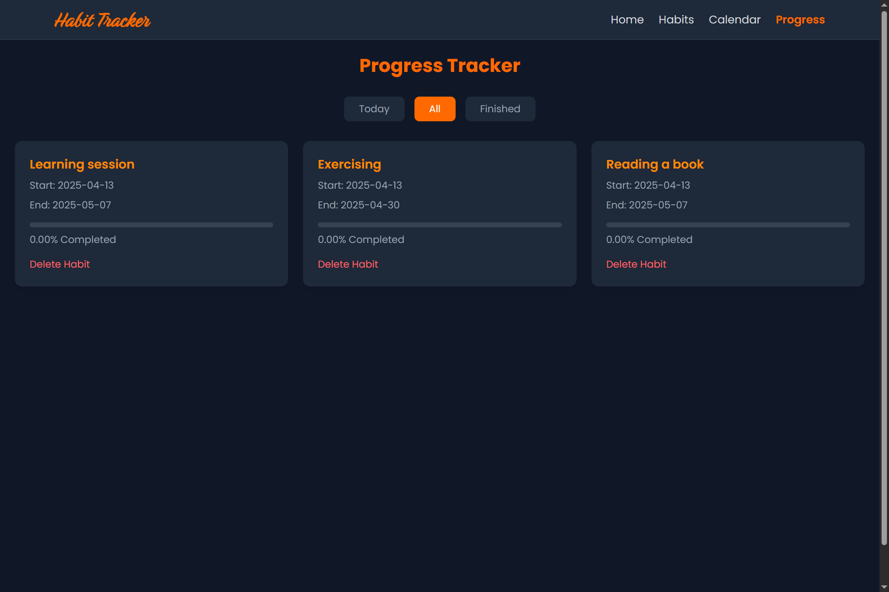

# 🧠 Habit Tracker App V2

A simple, elegant, and interactive habit tracking application built with **React**, **Vite**, and **Tailwind CSS**. Version 2 introduces **Dark Mode**, animated transitions, and a cleaner UI/UX for tracking personal habits and routines.

<!-- Main Banner -->
<p align="center">
  
</p>

<!-- Screenshots Grid -->
## 📸 App Preview

<div align="center" style="display: grid; grid-template-columns: repeat(2, 1fr); gap: 20px; padding: 20px; max-width: 800px; margin: 0 auto;">
  <!-- Feature 1 -->
  <figure style="margin: 0; padding: 10px; background: #f6f8fa; border-radius: 8px; border: 1px solid #e1e4e8;">
    
    <figcaption style="text-align: center; margin-top: 10px; font-size: 0.9em;"><b>▲</b> Adding a Personalized Habit</figcaption>
  </figure>

  <!-- Feature 2 -->
  <figure style="margin: 0; padding: 10px; background: #f6f8fa; border-radius: 8px; border: 1px solid #e1e4e8;">
    
    <figcaption style="text-align: center; margin-top: 10px; font-size: 0.9em;"><b>▲</b> Finding Your Best Habits</figcaption>
  </figure>

  <!-- Feature 3 -->
  <figure style="margin: 0; padding: 10px; background: #f6f8fa; border-radius: 8px; border: 1px solid #e1e4e8;">
    
    <figcaption style="text-align: center; margin-top: 10px; font-size: 0.9em;"><b>▲</b> Calendar of Habits</figcaption>
  </figure>

  <!-- Feature 4 -->
  <figure style="margin: 0; padding: 10px; background: #f6f8fa; border-radius: 8px; border: 1px solid #e1e4e8;">
    
    <figcaption style="text-align: center; margin-top: 10px; font-size: 0.9em;"><b>▲</b> Habit Management</figcaption>
  </figure>
</div>


## 🌟 Features

### 🏠 Home Page
- **Interactive Hero Sections** showcasing the purpose and benefits of the app
- **Features Overview** explaining how the habit tracker works and the value it offers
- **Clean UI** with responsive design for all devices

### ✅ Habits Management
- **Intuitive Form** for manually adding habits with proper data validation
- **Habit Assessment Test** where users answer questions to receive a percentage breakdown of their habit categories
- **Habit Categories** to organize different types of routines

### 📅 Calendar View
- **Visual Representation** of habits as colored dots on a calendar
- **Interactive Legend** matching each dot to its corresponding habit
- **Monthly Overview** of habit completion and streaks

### 📈 Progress Tracking
- **Comprehensive Line Graphs** displaying completion rates over time
- **Today's Habits** section with one-click "Mark as Complete" functionality
- **Streak Counting** to motivate consistent habit formation


### 🌙 Dark Mode Only

- **Enjoy a sleek dark theme** with smooth transitions
- **Automatically** activates based on your system's dark mode preference
- **Your preference** is saved and persists across sessions

## 🧩 Tech Stack

<p align="center">
  
  
  
  
  
  
</p>

- ⚛️ **React** - UI component library
- ⚡ **Vite** - Fast build tool and development server
- 🎨 **Tailwind CSS** - Utility-first CSS framework
- 📊 **Chart.js** - Data visualization library
- 🎞 **Framer Motion** - Animation library
- 📂 **LocalStorage** - Client-side data persistence
- 🔀 **React Router** - Navigation and routing

## 🛠 Installation & Setup

```bash
# Clone the repository
git clone https://github.com/Rida-Lad/Habit-Tracker-App-V2.git

# Navigate into the project folder
cd habit-tracker-v2

# Install dependencies
npm install

# Start the development server
npm run dev
```

The app will be running at http://localhost:5173


## 🧠 Vision Behind the App

This habit tracker was designed with a few key principles in mind:

- **Simplicity First**: Clean interface that doesn't overwhelm users
- **Visual Feedback**: See your progress through intuitive visualizations
- **Flexibility**: Track any type of habit, from fitness to productivity
- **Data Insights**: Learn about your behavior patterns through testing and analytics
- **Aesthetic Experience**: Beautiful design with dark mode support keeps users engaged


## 🤝 Contributing

Contributions are welcome! Please feel free to submit a Pull Request.

1. Fork the repository
2. Create your feature branch (`git checkout -b feature/amazing-feature`)
3. Commit your changes (`git commit -m 'Add some amazing feature'`)
4. Push to the branch (`git push origin feature/amazing-feature`)
5. Open a Pull Request


<p align="center">Made with ❤️ for better habits</p>
